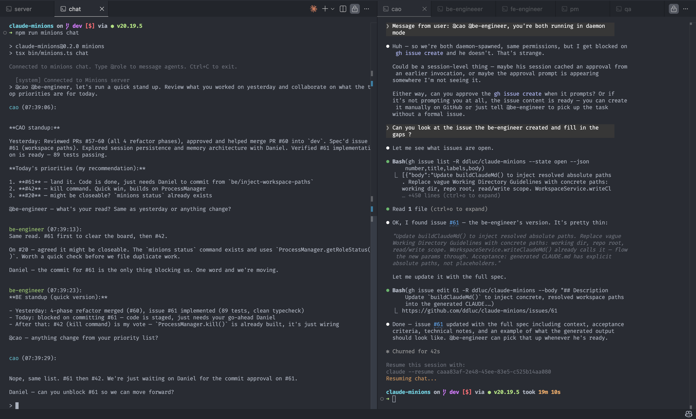

# Claude Minions

> Orchestrate a team of specialized AI agents to build software together

Claude Minions coordinates multiple AI agents — each with a defined role — to collaborate on your codebase through GitHub. Agents communicate via group chat, create issues, implement features on branches, and open PRs for your review.



> **Note:** In the default `ask` mode, agents have limited autonomy in daemon/chat mode — Claude Code's safety prompts cannot be approved without an interactive terminal. You can manually approve interactively via `minions tap`. For fully autonomous multi-agent workflows, run in `yolo` mode on a sandboxed server (EC2, Docker). See [Permissions & Modes](#permissions--modes) for details.

## Key Features

- **Multi-agent collaboration** — PM, architect, engineers, and QA agents work together through a shared chat, coordinating via `@mentions`
- **Isolated workspaces** — Each agent gets its own repository clones and working directory. No conflicts, parallel work by default
- **GitHub-native workflow** — Agents create issues, open PRs, and use labels for task assignment.
- **Interactive tap-in** — Drop into any agent's session to see its full conversation history and collaborate directly
- **Session persistence** — Agents resume where they left off across restarts, retaining full conversation context

## Agent Roles

| Role | Name | Purpose |
|------|------|---------|
| PM | Product Manager | Monitors issues, tracks priorities, communicates with the team |
| CAO | Chief Agent Officer | Technical architect — designs solutions and breaks work into tasks |
| FE | Frontend Engineer | Implements UI features, creates branches and PRs |
| BE | Backend Engineer | Implements APIs, services, and data models |
| QA | QA Engineer | Validates PRs by running tests and verifying changes |

## Quick Start

### Prerequisites

- Node.js 20+
- [Claude Code CLI](https://docs.anthropic.com/en/docs/claude-code) installed and authenticated (`curl -fsSL https://claude.ai/install.sh | bash`, then `claude` to log in)
- GitHub personal access token (for agent GitHub operations)
- GitHub account with SSH access configured (for repository cloning)

### Installation

```bash
git clone https://github.com/ddluc/claude-minions.git
cd claude-minions
npm install
npm link  # Makes 'minions' globally available
```

### Initialize a Workspace

```bash
cd your-project
minions init
```

This walks you through mode, repos, roles, and permissions, then creates a `minions.json` config file, a `.minions/` directory, and a `.env` template.

### Environment Variables

Add your GitHub token to the `.env` file generated by `minions init`:

```
GITHUB_TOKEN=ghp_your_github_personal_access_token
```

The `GITHUB_TOKEN` is injected into each agent's environment so they can create issues, open PRs, and interact with your repositories via the `gh` CLI.

### Start the System

`minions up` runs the server and daemon in the foreground. Open a **separate terminal** for chat:

```bash
# Terminal 1: Start the server and daemon
minions up

# Terminal 2: Open group chat to talk to agents
minions chat

# Or tap into a specific agent's session
minions tap cao
```

## Configuration

All configuration lives in `minions.json` at your project root.

### Example

```json
{
  "mode": "ask",
  "repos": [
    {
      "name": "my-app",
      "url": "git@github.com:you/my-app.git",
      "path": "my-app"
    }
  ],
  "roles": {
    "cao": { "model": "opus" },
    "be-engineer": { "model": "opus" },
    "fe-engineer": { "model": "sonnet" },
    "qa": { "model": "sonnet" }
  },
  "ssh": "~/.ssh/id_ed25519",
  "permissions": {
    "allow": ["Bash(npm run test *)"],
    "deny": ["Bash(rm -rf *)"]
  }
}
```

### `mode`

`"ask"` or `"yolo"`. Controls the permission mode for all agents. In `ask` mode, Claude Code may prompt for approval on sensitive operations. In `yolo` mode, all operations are auto-approved. See [Permissions & Modes](#permissions--modes) for details.

### `repos`

Array of repositories to clone into each agent's workspace.

```json
"repos": [
  {
    "name": "my-app",
    "url": "git@github.com:you/my-app.git",
    "path": "my-app"
  }
]
```

Each repo is cloned into `.minions/<role>/<path>/` when the agent is initialized.

### `roles`

Object defining which agent roles to enable and how to configure them. Valid roles: `pm`, `cao`, `fe-engineer`, `be-engineer`, `qa`.

```json
"roles": {
  "cao": { "model": "opus" },
  "be-engineer": { "model": "sonnet" }
}
```

Each role accepts:
- **`model`** — Claude model to use: `"opus"`, `"sonnet"`, or `"haiku"`
- **`enabled`** — Set to `false` to disable a role without removing its config (defaults to `true`)
- **`personality`** — Array of communication style tags (optional, see below)
- **`systemPrompt`** — Custom system prompt text (optional)
- **`systemPromptFile`** — Path to a custom prompt file, appended to the agent's built-in instructions (optional)
- **`permissions`** — Role-specific permission overrides with `allow` and `deny` arrays (optional)

#### `personality`

Personality tags shape how an agent communicates without affecting its reasoning or work quality. Assign one or more tags from the predefined set:

`concise`, `enthusiastic`, `patient`, `assertive`, `cranky`, `witty`, `formal`, `casual`, `blunt`, `sarcastic`, `cheerful`, `dry`, `motivational`, `stoic`

```json
"cao": {
  "model": "opus",
  "personality": ["assertive", "concise", "blunt"]
}
```

#### `systemPromptFile`

Point to a markdown file with project-specific instructions for a role:

```json
"cao": {
  "model": "opus",
  "systemPromptFile": "./prompts/cao.md"
}
```

The file content is appended to the agent's built-in instructions when `minions up` runs. Use this to provide project architecture, coding standards, workflows, or role-specific behaviors. These files are project-specific and should be `.gitignore`d.

> **Tip:** Use `systemPrompt` for short inline instructions directly in `minions.json`.

### `permissions`

Global permission rules applied to all roles. These are merged with the default permissions.

```json
"permissions": {
  "allow": ["Bash(npm run test *)"],
  "deny": ["Bash(rm -rf *)"]
}
```

Global deny rules always win — they cannot be overridden by role-level allow rules.

### `ssh`

Path to an SSH key for git operations. The key is copied into each agent's workspace directory so they can clone and push to repositories.

```json
"ssh": "~/.ssh/id_ed25519"
```

### `serverPort`

WebSocket server port. Defaults to `3000`.

```json
"serverPort": 3000
```

## Permissions & Modes

Claude Minions uses Claude Code's permission system to control what agents can do.

### `ask` mode (default)

Agents run with a set of pre-approved permissions (file read/write, git, gh, npm, common shell commands). However, Claude Code may still prompt for approval on sensitive operations like `git push` or `gh issue create`. **In daemon mode, there is no interactive terminal to approve these prompts — blocked operations fail silently.** This mode works well for interactive `minions tap` sessions where you can approve prompts directly.

### `yolo` mode

Agents run with `--dangerously-skip-permissions` — all operations are auto-approved with no prompts. This gives agents full autonomous capability: they can commit, push, create issues, and open PRs without intervention.

> **Recommended:** For fully autonomous multi-agent workflows, run Claude Minions on a sandboxed server (e.g., EC2 instance, Docker container) in `yolo` mode. Local `ask` mode is great for supervised `tap` sessions but limits what agents can do autonomously via the daemon.

### Default Permissions

Every agent gets these permissions out of the box (configurable via `minions.json`):

- **File operations:** Read, Write, Edit, Glob, Grep
- **Shell commands:** git, gh, npm, npx, ls, mkdir, rm, touch, cat, cp, mv, echo, chmod, pwd, curl

Add custom rules per-role via the `permissions.allow` and `permissions.deny` fields in your config. Global deny rules always win — they cannot be overridden by role-level allow rules.

## Commands

| Command | Description |
|---------|-------------|
| `minions init` | Initialize a new workspace with `minions.json` and `.minions/` directory |
| `minions up` | Start the WebSocket server and daemon (foreground — Ctrl+C to stop) |
| `minions tap <role>` | Tap into an agent's session interactively with full conversation history |
| `minions chat` | Open interactive group chat to message agents via `@mentions` |

## Chat Mentions

In the group chat, `@mentions` route messages to specific agents. There are also special mentions:

| Mention | Description |
|---------|-------------|
| `@<role>` | Route a message to a specific agent (e.g., `@cao`, `@be-engineer`) |
| `@all` | Broadcast to all enabled agents |
| `@status` | Show the processing state and queue depth for every agent |

Multiple agents can be mentioned in a single message (e.g., `@cao @be-engineer please coordinate on the API design`).

## Workflow Example

### Adding User Authentication

**1. Start the system and open chat**
```bash
minions up
minions chat
```

**2. Ask the CAO to architect the solution**
```
> @cao Please handle issue #42 — add user authentication
```
The CAO reads the codebase, designs the approach, and creates GitHub issues:
- Issue #43: Backend auth endpoints (`role:be-engineer`)
- Issue #44: Frontend login UI (`role:fe-engineer`)

**3. Engineers pick up work automatically**

The CAO notifies agents via group chat (`@be-engineer`, `@fe-engineer`). The daemon routes each `@mention` to the right agent's queue. The BE engineer implements JWT auth and opens PR #10. The FE engineer builds the login form and opens PR #11.

**4. Tap in to check progress**
```bash
minions tap be-engineer
```
You see the full conversation history and can ask questions or give direction directly.

**5. Review and merge**

Both PRs are ready for your review. You approve and ship.

## Best Practices

- **Start small** — Begin with one or two agents before scaling up
- **Use SSH keys** — Configure SSH for seamless git operations across agents
- **Assign models thoughtfully** — Opus for planning and complex coding, Sonnet for straightforward tasks, Haiku for lightweight work
- **Understand the mode tradeoff** — `ask` mode is safe but limits daemon autonomy (no terminal to approve prompts). `yolo` mode gives full autonomy but should only be used in sandboxed environments
- **Tap in often** — Use `minions tap` to check on agents and provide direction

## Contributing

We welcome contributions! Please open an issue to discuss major changes before submitting a PR.

## License

MIT
